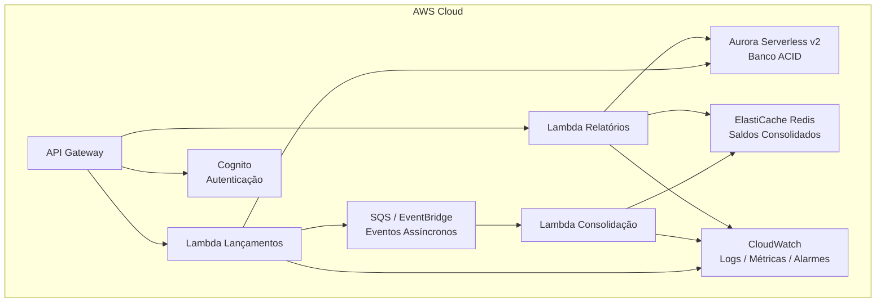
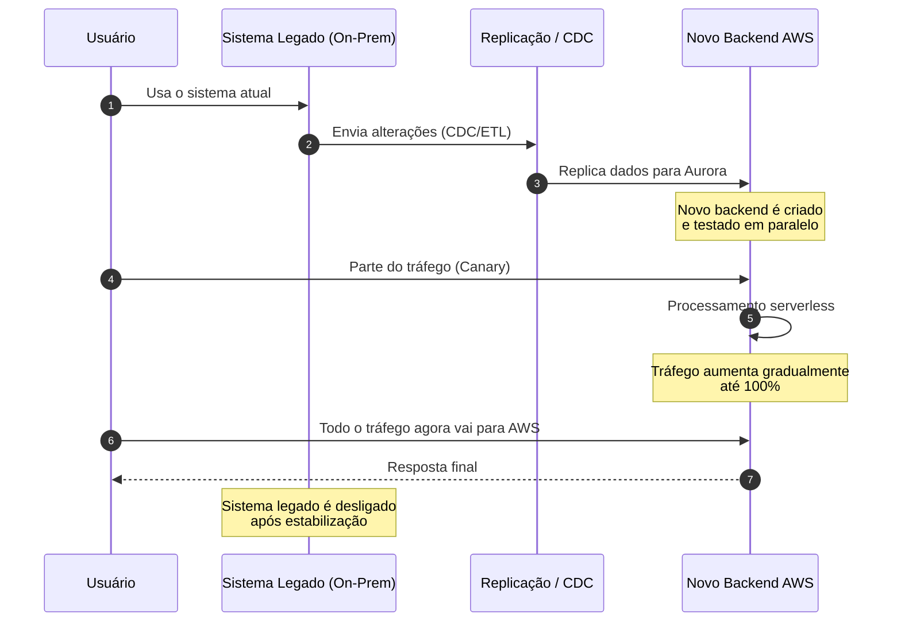
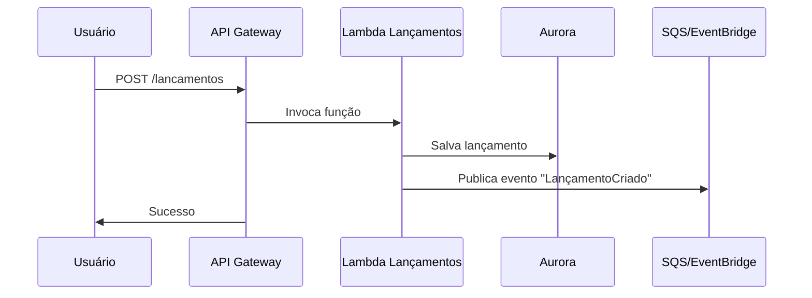
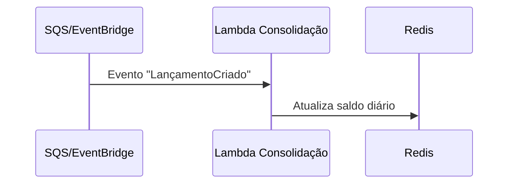
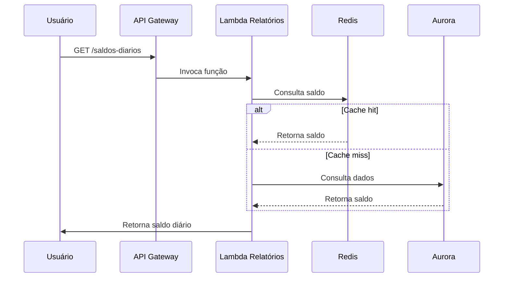

# 🧾 Sistema de Fluxo de Caixa, Consolidação Diária e Relatórios  
Arquitetura moderna, escalável e serverless na AWS, com suporte a migração gradual a partir de sistemas legados on‑premise.

---

## 📌 Visão Geral  
Este projeto implementa um sistema de fluxo de caixa com:

- Registro de lançamentos (débito/crédito)  
- Consolidação diária assíncrona  
- Relatórios rápidos  
- Arquitetura serverless  
- Alta escalabilidade e baixo acoplamento  
- Migração gradual de ambiente legado  

---

# 🏗️ Arquitetura Final (AWS Serverless)



Domínios Funcionais e Capacidades
=================================

**Lançamentos**
---------------

*   Registrar lançamento
    
*   Consultar lançamentos
    
*   Auditar histórico
    
*   Publicar evento “LançamentoCriado”
    

**Consolidação**
----------------

*   Processar eventos
    
*   Calcular saldo diário
    
*   Atualizar Redis
    
*   Reprocessar falhas (DLQ)
    

**Relatórios**
--------------

*   Consultar saldo diário
    
*   Gerar relatórios por período
    
*   Fallback para Aurora
    

**Segurança**
-------------

*   Autenticação (Cognito)
    
*   Autorização por comerciante
    
*   Tokens JWT
    

**Observabilidade**
-------------------

*   Logs estruturados
    
*   Métricas técnicas e de negócio
    
*   Alarmes
    
*   Tracing (X-Ray)
    

 Requisitos Funcionais (RF)
============================

*   **RF01** Registrar lançamento financeiro
    
*   **RF02** Consultar lançamentos
    
*   **RF03** Publicar evento de lançamento criado
    
*   **RF04** Processar eventos de lançamento
    
*   **RF05** Atualizar saldo diário consolidado
    
*   **RF06** Registrar falhas em DLQ
    
*   **RF07** Consultar saldo diário
    
*   **RF08** Gerar relatórios consolidados
    
*   **RF09** Autenticação via Cognito
    
*   **RF10** Autorização por comerciante
    
*   **RF11** Registrar logs estruturados
    
*   **RF12** Monitorar filas, erros e latência
    

 Requisitos Não Funcionais (RNF)
=================================

### **Desempenho**

*   Saldo diário: < 50 ms (Redis)
    
*   Registro de lançamento: < 200 ms
    

### **Escalabilidade**

*   Suporte a 50 req/s
    
*   Fila absorve picos
    

### **Disponibilidade**

*   Multi‑AZ
    
*   Tolerância a falhas
    
*   Independência entre serviços
    

### **Segurança**

*   TLS obrigatório
    
*   JWT
    
*   IAM least privilege
    
*   Criptografia KMS
    

### **Manutenibilidade**

*   Baixo acoplamento
    
*   Observabilidade completa
    

### **Custo**

*   Pay‑per‑use
    
*   Cache reduz carga no Aurora
    

 Justificativa da Arquitetura e Tecnologias
============================================

### **Serverless**

*   Escalabilidade automática
    
*   Baixo custo
    
*   Alta disponibilidade
    
*   Zero manutenção
    

### **Aurora Serverless**

*   Transações ACID
    
*   Consistência forte
    
*   SQL completo
    

### **Redis**

*   Leitura ultrarrápida
    
*   Ideal para saldos consolidados
    

### **SQS/EventBridge**

*   Desacoplamento total
    
*   Resiliência
    
*   Reprocessamento via DLQ
    

### **Lambda**

*   Simples
    
*   Escalável
    
*   Barato


# Arquitetura de Transição (Migração do Legado)
# High-Level — Convivência Legado + AWS

```text
+---------------------------+     +-------------------------------+
| Sistema Legado On-Prem    |     | Novo Backend AWS             |
| - Banco antigo            |     | - API Gateway                |
| - Lançamentos             |     | - Lambdas                    |
+---------------------------+     | - Aurora                     |
                                  | - Redis                      |
                                  +-------------------------------+

                │ Sincronização / CDC / ETL
                ▼

+---------------------------+
| Camada de Integração     |
| - Replica dados           |
| - Publica eventos         |
+---------------------------+
```

# Estratégia de Migração (6 Rs da AWS)
Replatform – mover partes para AWS com ajustes mínimos

Refactor – modernizar para serverless

Retain – manter legado durante a transição

Retire – desligar legado ao final

## Fluxo de Migração (Simplificado)

1. Conectar on-prem à AWS (VPN/Direct Connect)
2. Replicar dados para Aurora (DMS/CDC)
3. Criar novo backend serverless
4. Roteamento gradual (canary / feature flags)
5. Migrar funcionalidades por domínio
6. Aumentar tráfego para AWS
7. Cutover final
8. Desligar legado



**Monitoramento e Observabilidade**
===================================

### **Logs**

*   CloudWatch Logs
    
*   Logs estruturados (JSON)
    

### **Métricas**

*   Latência
    
*   Erros
    
*   Tamanho da fila
    
*   Cache hit/miss
    

### **Alarmes**

*   DLQ > 0
    
*   Latência alta
    
*   Erros de Lambda
    

### **Tracing**

*   AWS X-Ray


**Segurança e Integração**
==========================

### **Autenticação e Autorização**

*   Cognito + JWT
    
*   Claims com comercianteId
    

### **Comunicação Segura**

*   TLS 1.2+
    
*   VPC privada
    
*   SGs restritivos
    

### **IAM Least Privilege**

*   Cada Lambda só acessa o que precisa
    

### **Auditoria**

*   CloudTrail
    
*   Logs de acesso
    
*   Logs de falha


# Diagramas de Sequência (High-Level)

## Registrar Lançamento


## Consolidação


## Consulta de Saldo



