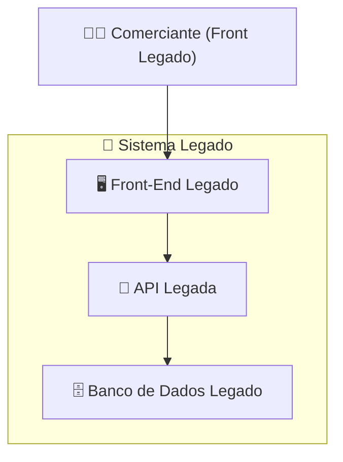
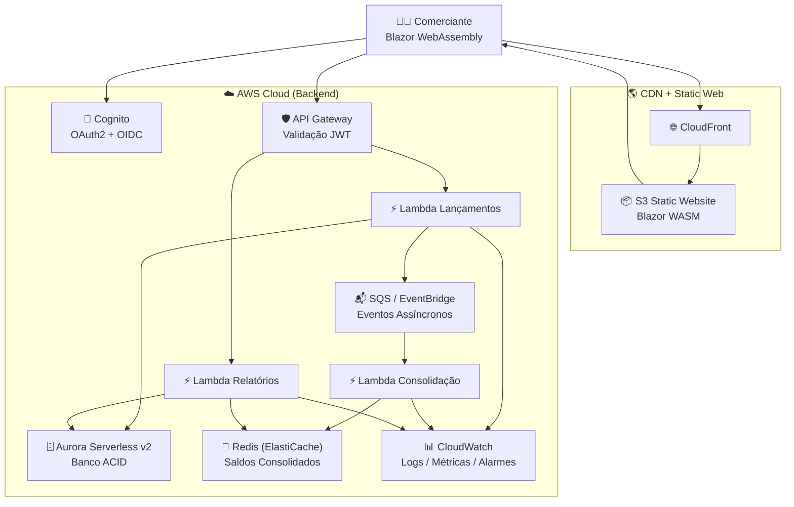
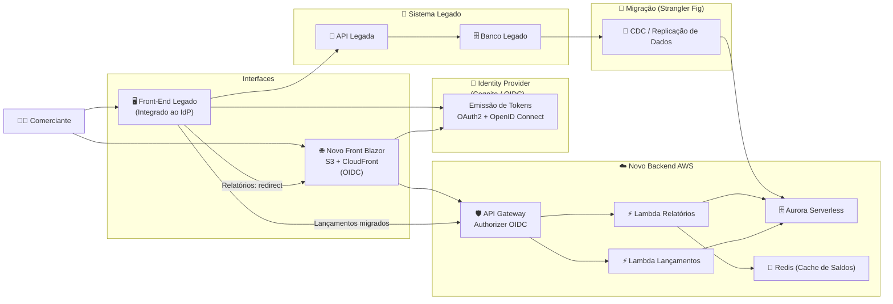
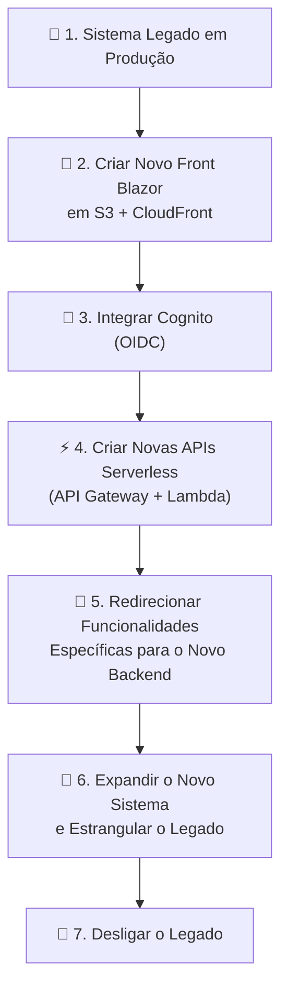
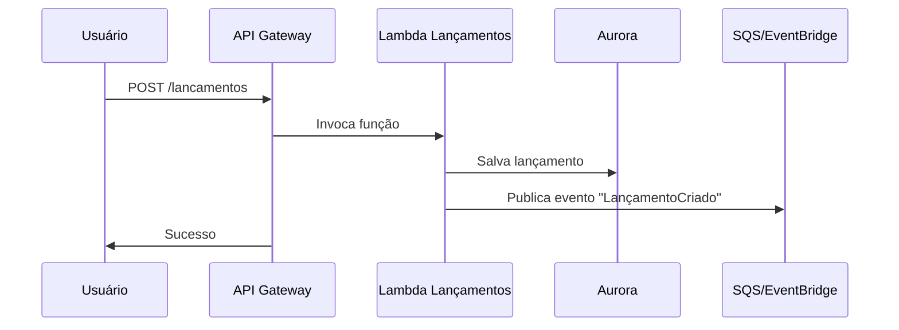
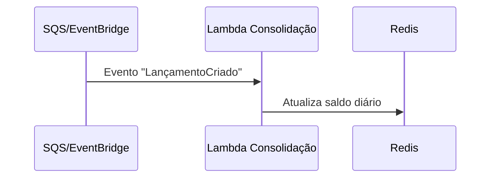
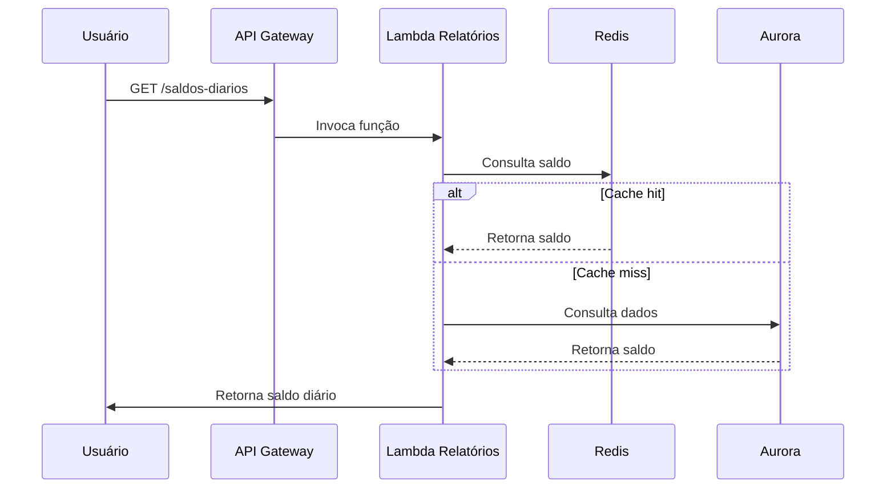

# 1. O Problema / Contexto Atual
O sistema atual é composto por:

- Front-end legado monolítico
- Backend legado acoplado
- Banco de dados único
- Autenticação própria e não padronizada
- Baixa escalabilidade
- Dificuldade de manutenção
- Risco operacional ao evoluir funcionalidades

O negócio exige:

- Modernização sem interrupção
- Melhor performance
- Segurança unificada
- Escalabilidade sob demanda
- Evolução contínua
- Migração sem “big bang”


# 2.Objetivo da Migração
Modernizar o front com Blazor WebAssembly.
Modernizar o backend com arquitetura serverless.
Garantir segurança com OAuth2 + OpenID Connect.
Migrar sem downtime.
Manter o legado funcionando até o fim.
Toda a plataforma — legado e novo — usa **o mesmo Identity Provider** (ex.: Cognito OIDC).

### Benefícios:
- SSO entre front legado e novo front
- Tokens JWT padronizados
- Segurança consistente
- Autorização multi-tenant via claims
- Migração suave sem múltiplos logins

### Fluxo:
- Front legado → IdP
- Novo front Blazor → IdP
- API Gateway → valida JWT
- Lambdas → usam claims (`merchantId`, `roles`)


# 3.Estratégia de Migração — Strangler Fig Pattern
1. **Manter o legado funcionando**
2. Criar o novo sistema ao lado do legado
3. Redirecionar funcionalidades específicas para o novo front/backend
4. Usar **CDC** para sincronizar dados entre legado e novo banco
5. Expandir o novo sistema gradualmente
6. “Estrangular” o legado até substituí-lo por completo


# 4.Arquitetura Atual (Legado)




# 5.🏗️ Arquitetura Final (Novo sistema)
## 🧾 Sistema de Fluxo de Caixa, Consolidação Diária e Relatórios  

- Registro de lançamentos (débito/crédito)  
- Consolidação diária assíncrona  
- Relatórios rápidos  
- Arquitetura serverless  
- Alta escalabilidade e baixo acoplamento  
- Migração gradual de ambiente legado  
---




# 6. Arquitetura de Transição (Migração do Legado) - Strangler



## Fluxo de Migração (Simplificado)





# 7. Domínios Funcionais e Capacidades (Arquitetura de negócio)


**Lançamentos**
---------------

*   Registrar lançamento
    
*   Consultar lançamentos
    
*   Auditar histórico
    
*   Publicar evento “LançamentoCriado”
    

**Consolidação**
----------------

*   Processar eventos
    
*   Calcular saldo diário
    
*   Atualizar Redis
    
*   Reprocessar falhas (DLQ)
    

**Relatórios**
--------------

*   Consultar saldo diário
    
*   Gerar relatórios por período
    
*   Fallback para Aurora
    

**Segurança**
-------------

*   Autenticação (Cognito)
    
*   Autorização por comerciante
    
*   Tokens JWT
    

**Observabilidade**
-------------------

*   Logs estruturados
    
*   Métricas técnicas e de negócio
    
*   Alarmes
    
*   Tracing (X-Ray)
    

#8.  Requisitos Funcionais (RF)


*   **RF01** Registrar lançamento financeiro
    
*   **RF02** Consultar lançamentos
    
*   **RF03** Publicar evento de lançamento criado
    
*   **RF04** Processar eventos de lançamento
    
*   **RF05** Atualizar saldo diário consolidado
    
*   **RF06** Registrar falhas em DLQ
    
*   **RF07** Consultar saldo diário
    
*   **RF08** Gerar relatórios consolidados
    
*   **RF09** Autenticação via Cognito
    
*   **RF10** Autorização por comerciante
    
*   **RF11** Registrar logs estruturados
    
*   **RF12** Monitorar filas, erros e latência
    

# 9. Requisitos Não Funcionais (RNF)


### **Desempenho**

*   Saldo diário: < 50 ms (Redis)
    
*   Registro de lançamento: < 200 ms
    

### **Escalabilidade**

*   Suporte a 50 req/s
    
*   Fila absorve picos
    

### **Disponibilidade**

*   Multi‑AZ
    
*   Tolerância a falhas
    
*   Independência entre serviços
    

### **Segurança**

*   TLS obrigatório
    
*   JWT
    
*   IAM least privilege
    
*   Criptografia KMS
    

### **Manutenibilidade**

*   Baixo acoplamento
    
*   Observabilidade completa
    

### **Custo**

*   Pay‑per‑use
    
*   Cache reduz carga no Aurora
    

# 10. Justificativa da Arquitetura e Tecnologias

Atributos:
### ✅ Escalabilidade

Cada serviço escala de forma independente.

### ✅ Disponibilidade

Falhas isoladas não derrubam o sistema.

### ✅ Performance

Relatórios via Redis, lançamentos via Lambda, consolidação assíncrona.

### ✅ Segurança

Princípio de menor privilégio, JWT por serviço, superfícies menores.

### ✅ Observabilidade

Logs, métricas e alarmes por domínio.

### ✅ Manutenibilidade

Evolução contínua sem impacto no restante.

### ✅ Custo

Pay-per-use, cache reduz carga, Aurora Serverless ajusta capacidade.

### ✅ Suporte ao Strangler Fig Pattern

Permite substituir o legado por partes.

Produtos:

### **Serverless**

*   Escalabilidade automática
    
*   Baixo custo
    
*   Alta disponibilidade
    
*   Zero manutenção
    

### **Aurora Serverless**

*   Transações ACID
    
*   Consistência forte
    
*   SQL completo
    

### **Redis**

*   Leitura ultrarrápida
    
*   Ideal para saldos consolidados
    

### **SQS/EventBridge**

*   Desacoplamento total
    
*   Resiliência
    
*   Reprocessamento via DLQ
    

### **Lambda**

*   Simples
    
*   Escalável
    
*   Barato


# 11. Monitoramento e Observabilidade**

### **Logs**

*   CloudWatch Logs
    
*   Logs estruturados (JSON)
    

### **Métricas**

*   Latência
    
*   Erros
    
*   Tamanho da fila
    
*   Cache hit/miss
    

### **Alarmes**

*   DLQ > 0
    
*   Latência alta
    
*   Erros de Lambda
    

### **Tracing**

*   AWS X-Ray


# 12. Segurança e Integração**
==========================

### **Autenticação e Autorização**

*   Cognito + JWT
    
*   Claims com comercianteId
    

### **Comunicação Segura**

*   TLS 1.2+
    
*   VPC privada
    
*   SGs restritivos
    

### **IAM Least Privilege**

*   Cada Lambda só acessa o que precisa
    

### **Auditoria**

*   CloudTrail
    
*   Logs de acesso
    
*   Logs de falha


# 13. Diagramas de Sequência (High-Level)

## Registrar Lançamento


## Consolidação


## Consulta de Saldo

# 14. Finops (High-Level)
## 📊 FinOps – Resumo de Custos AWS

A arquitetura foi projetada seguindo princípios **FinOps** e **Serverless**, priorizando **baixo custo em idle**, **escalabilidade automática** e **pagamento por uso**.

### 📈 Cenário considerado
- ~1.000.000 requisições por mês
- Região AWS: us-east-1
- Perfil de uso: SaaS financeiro (lançamentos, consolidação e relatórios)

### 💰 Custo mensal estimado
**≈ USD 100 / mês**

### 🔍 Principais componentes de custo
- **Aurora Serverless v2 (~75%)**  
  Banco transacional ACID com auto scale e ACU mínimo configurado.
- **ElastiCache Redis (~12%)**  
  Cache de saldos consolidados, reduzindo leituras no banco.
- **Demais serviços (~13%)**  
  CloudFront, S3, API Gateway (HTTP API), Lambda, SQS/EventBridge e CloudWatch.

### ✅ Benefícios FinOps
- Sem servidores dedicados (EC2 ou Kubernetes)
- Zero custo quando não há tráfego
- Escala automática conforme a demanda
- Custos previsíveis por volume de requisições

### ⚠️ Pontos de atenção
- Configurar corretamente o ACU mínimo do Aurora
- Definir política de retenção de logs no CloudWatch
- Aplicar throttling no API Gateway para evitar abuso

> Esta estimativa é aproximada e pode variar conforme o volume real de uso, padrões de acesso e região AWS.


# 15.Como rodar a aplicação localmente

## 🧰 Pré-requisitos – LocalStack em Docker
- .NET 10 SDK installed
- PostgreSQL available and reachable
- Docker
- LocalStack
- (Optional) dotnet-ef tool: `dotnet tool install --global dotnet-ef`

Para executar o LocalStack localmente utilizando Docker, certifique-se de que os seguintes requisitos estejam atendidos.

### 🖥️ Sistema Operacional
- Windows 10/11 (com WSL2)
- macOS
- Linux

1) Subir o localstack/postgree usando o docker

```  
docker-compose up -d
```  

2. Verificar connection strings
- Edit the `Default` connection string in `src/Lancamentos.Api/appsettings.json` and `src/Relatorios.Api/appsettings.json`  and `src/Consolidacao.Worker/appsettings.json` or set an environment variable:
3. Build solution
4. Aplicar migrations se necessário
  ```bash
  dotnet ef database update --startup-project src/Infrastructure
  ```

5. Subir os projetos conforme imagem abaixo.


## Como testar 

## (Lancamento.Api)
 - `http://localhost:5000/swagger`

  - 📘 API de Lançamentos
=====================

API responsável por registrar lançamentos financeiros (crédito e débito) em um fluxo de caixa diário.

## 📌 Endpoint

### ➕ Registrar Lançamento

- `POST /lancamentos`  
- Descrição: Registra um lançamento financeiro para uma data específica.

### 📥 Request

- Headers:
  - `Content-Type: application/json`

- Body (exemplo):
### 🧾 Campos do Request

| Campo     | Tipo                | Obrigatório | Descrição                     |
|-----------|---------------------|-------------|-------------------------------|
| `valor`   | number (double)     | ✅          | Valor do lançamento           |
| `descricao` | string            | ❌          | Descrição opcional            |
| `data`    | string (date)       | ✅          | Data no formato `yyyy-MM-dd`  |
| `tipo`    | integer             | ✅          | Tipo do lançamento (enum)     |

#### 🔢 Enum: `TipoLancamento`

| Código | Descrição |
|--------|-----------|
| 1      | Crédito   |
| 2      | Débito    |

---

### 📤 Response

- Sucesso:
  - Status: `200 OK`
  - Mensagem: "Lançamento registrado com sucesso."

Exemplo de resposta:
### ⚠️ Possíveis Erros

| Status | Descrição                         |
|--------|-----------------------------------|
| 400    | Dados inválidos                   |
| 422    | Violação de regra de negócio      |
| 500    | Erro interno                      |

---

## 🧠 Observações Técnicas

- Arquitetura orientada a CQRS.  
- Validações realizadas na Application Layer.  
- Consolidação diária pode ocorrer de forma assíncrona (event-driven).  
- Compatível com MassTransit / SQS / Kafka.

---

# (Relatorio.Api)
API responsavel por gerar o relatório consolidado do dia. 

**Formato da data do relatório:** `yyyy-MM-dd`

## Exemplo de requisição
`GET /relatorios/2025-01-10`

## Response (200 OK)
Relatório consolidado do dia.
### Campos do Response
| Campo | Tipo            | Descrição                     |
|-------|-----------------|-------------------------------|
| dia   | string (date)   | Data do relatório (yyyy-MM-dd)|
| saldo | number (double) | Saldo consolidado do dia      |

### Possíveis Erros
| Status | Descrição                  |
|--------|---------------------------|
| 400    | Data inválida             |
| 404    | Relatório não encontrado  |
| 500    | Erro interno              |

### Observações Técnicas
- API de consulta (Query)
- Segue padrão CQRS
- Dados consolidados previamente via eventos
- Leitura otimizada (read model)
- Compatível com event-driven architecture

### Exemplo de uso (curl)
    curl -X GET http://localhost:5000/relatorios/2025-01-10# Relatórios — API de Consulta

# (Frontend)

Abaixo conferir a URL do frontend do comerciante.

  - `https://localhost:5280/fluxo-caixa`

Print screen da tela:    


# 16. Testes funcionais e unitarios:


# 18. Proximos  passos 

Falhas transitórias sejam reprocessadas (retry) dlq

Mensagens duplicadas não gerem efeito colateral 

Implementar log e observability

Implementar autenticação e autorização

Implementar cache em diversas camadas

Implementar testes de contrato de api

Implementar testes de perfomance

Implementar demais testes funcionais e unitarios

Segregar os banco de dados se necessário (Redis) 

Implementar infra com código utilizando cloud formation/terraform

Adicionar novos/acrescentar requisitos funcionais 

Deploy arquitetura na AWS (CI/CD)


